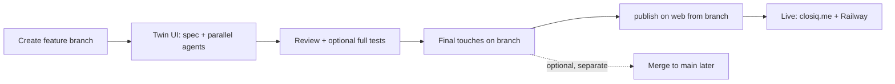

# Agent Workflows: Twin UI & Publish on Web

This document describes the two Cursor agent workflows defined for **outfit-suggestor-app**. Use them from chat with plain trigger phrases — no manual orchestration required.

---

## Overview

| Workflow | Purpose | When to use |
|----------|---------|-------------|
| **Twin UI** | Build matching web + iOS UI/UX from one instruction | Feature work, parity fixes, copy/layout changes on the **current branch** |
| **Publish on Web** | Test, commit, push, and deploy to production | Ready to ship after UI/backend changes are done |

They complement each other:

```text
Twin UI (iterate on branch)  →  publish on web (ship from current branch)
```

Merge to `main` is **out of scope** for publish on web — do it separately if you want it later.

---

## Twin UI

**One instruction → platform-neutral spec → two parallel agents (web + iOS) → parity review → test gate.**

### Trigger

```text
Twin UI:

[Describe the UI/UX change — screens, copy, behavior]
```

Also accepts: `Parallel UI/UX on current branch`, `spawn both web and iOS agents`.

**Twin** always means two platforms, two agents, in parallel.

### Example

```text
Twin UI:

Add Past Suggestions to the wardrobe card overflow menu. Fix the menu so it is not hidden behind the next card.

iOS: keep iPhone and iPad UX identical — layout/spacing tweaks via horizontalSizeClass only.
```

### iPhone / iPad (iOS)

Keep iPhone and iPad UX the same — adapt layout, not behavior. Optional one-liner on every Twin UI prompt (see `AGENTS.md` and `.cursor/rules/ios-ui-ux.mdc`).

### What happens (step by step)

1. **Confirm branch** — work stays on the current git branch (e.g. `feature/ui-ux-final-touches`).
2. **Write spec** — orchestrator creates `.cursor/specs/<feature-slug>.md` from the template, including **Tests (required)** and whether **About** / **Guide** need updates.
3. **Backend first (if needed)** — orchestrator updates `backend/` and runs `pytest` when API or business logic changes. Skipped for pure UI work.
4. **Two parallel subagents** (single message, required):
   - **Web agent** → `frontend/**` only (includes `UserGuide.tsx` / `About.tsx` when spec requires)
   - **iOS agent** → `ios-client/**` only (includes `UserGuideView.swift` / `AboutView.swift` when spec requires)
5. **Parity review** — orchestrator compares both implementations to the spec, verifies About/Guide when required, and updates `IOS_WEB_FEATURE_PARITY.md` when capability changes.
6. **Ask before full tests** — orchestrator asks you to confirm before running complete suites (~several minutes).
7. **Full test gate** (after you confirm):
   - Web: all Jest unit + integration tests
   - iOS: all `OutfitSuggestorTests` + `OutfitSuggestorUITests`
   - Backend: full `pytest` (only if backend changed this feature)
8. **Test Execution Report** — orchestrator publishes pass/fail counts, durations, and failure details.
9. **Done** — only when all required suites pass (or you declined full tests → verification noted as pending).

### Roles and boundaries

The **orchestrator** (main chat) may only touch:

- `.cursor/specs/`
- `backend/` (when the feature needs it)
- `IOS_WEB_FEATURE_PARITY.md`
- Supporting docs for the spec

The orchestrator **must not** edit platform UI directly:

| Agent | Allowed | Forbidden |
|-------|---------|-----------|
| Web | `frontend/**` | `ios-client/**`, `backend/**` |
| iOS | `ios-client/**` | `frontend/**`, `backend/**` |

### Mandatory tests (during Twin UI)

| Owner | Requirement |
|-------|-------------|
| Orchestrator | Backend tests when `backend/` changes |
| Web agent | At least one new unit or integration test for new behavior; update Guide/About when spec requires |
| iOS agent | At least one new unit/integration test (UITest optional for E2E); update Guide/About when spec requires |
| Orchestrator (end) | Full web + iOS suites after your confirmation |

**A Twin UI feature is not complete** if the full web or iOS suite fails, new behavior has no tests, or the Test Execution Report is missing.

### Test commands (reference)

```bash
# Web (full suite)
cd frontend && npm test -- --watchAll=false --passWithNoTests

# iOS (full suite)
cd ios-client && xcodebuild test \
  -scheme OutfitSuggestor \
  -destination 'platform=iOS Simulator,name=iPhone 17' \
  -only-testing:OutfitSuggestorTests \
  -only-testing:OutfitSuggestorUITests

# Backend (when changed)
cd backend && . venv/bin/activate && pytest -q
```

### Commits

Agents **do not commit** unless you explicitly ask. Twin UI ends with implemented + tested code on your branch; you merge when ready.

### Configuration files

| File | Role |
|------|------|
| `.cursor/rules/parallel-ui-orchestrator.mdc` | Strict orchestration rules |
| `.cursor/rules/web-ui-ux.mdc` | Web agent scope |
| `.cursor/rules/ios-ui-ux.mdc` | iOS agent scope |
| `.cursor/skills/parallel-ui-ux/SKILL.md` | Full workflow, agent prompts, report template |
| `.cursor/specs/_template.md` | Spec template |
| `.cursor/specs/_test-report-template.md` | End-of-run report template |

---

## Publish on Web

**Test everything → commit → push → GitHub Pages → Railway** — all on the **current branch**.

Invoking this skill counts as explicit approval to **commit, push, and deploy**.

**Do not merge to `main`** as part of this workflow. Push `HEAD` on whatever branch you are on (e.g. `feature/ui-ux-final-touches`).

### Trigger

```text
publish on web
```

### What happens (step by step)

1. **Record branch** — e.g. `main` or `feature/ui-ux-final-touches`.
2. **Run all test suites** (mandatory gate — stop on any failure):

   | Suite | Command | Typical duration |
   |-------|---------|------------------|
   | Web | `cd frontend && npm test -- --watchAll=false --passWithNoTests` | ~3 s |
   | Backend | `cd backend && . venv/bin/activate && pytest -q` | ~4 min |
   | iOS | `xcodebuild test -scheme OutfitSuggestor …` | ~4–8 min |

   Optional one-liner:

   ```bash
   bash .cursor/skills/publish-on-web/scripts/run-all-tests.sh
   ```

3. **Commit** — stage relevant changes; **never** commit secrets (`.env.development`), build artifacts, or `xcuserdata/`.
4. **Push** — `git push -u origin HEAD` (current branch only — **no merge to `main`**).
5. **GitHub Pages** — `cd frontend && npm run deploy` (build + push to `gh-pages`).
6. **Railway** — `cd backend && railway up`.
7. **Verify** — health check and frontend URLs.
8. **Publish on Web — Report** — summary of tests, git, deploys, and live checks.

**If any test fails:** workflow stops. No commit, push, or deploy.

### Prerequisites

| Tool | Purpose |
|------|---------|
| `git` | Commit and push |
| `gh` | GitHub CLI (optional if git credentials work) |
| `railway` | Backend deploy (`railway link` from repo root) |
| `frontend/.env.production` | `REACT_APP_API_URL` for production build |

### Live URLs

| Target | URL |
|--------|-----|
| Custom domain | https://closiq.me |
| GitHub Pages | https://sajadparacha.github.io/outfit-suggestor-app |
| Backend (example) | https://web-production-dfcf8.up.railway.app |
| Health check | `<backend-url>/health` |

Pushing **`main`** may trigger `.github/workflows/deploy.yml` (GitHub Actions → gh-pages). That is optional CI — publish on web does **not** require merging to `main` first.

### What gets excluded from commits

- `frontend/.env.development` and other secret env files
- `ios-client/build*/`, `**/xcuserdata/**`
- `node_modules/`, `backend/venv/`, `__pycache__/`

### Configuration

| File | Role |
|------|------|
| `.cursor/skills/publish-on-web/SKILL.md` | Full workflow and report template |
| `.cursor/skills/publish-on-web/scripts/run-all-tests.sh` | Test-only gate script |
| `DEPLOYMENT_INSTRUCTIONS.md` | Manual deploy reference |
| `RAILWAY_DEPLOYMENT_STEPS.md` | Railway setup |
| `.github/workflows/deploy.yml` | CI deploy on push to `main` |

---

## Typical development cycle



1. **Branch** — e.g. `git checkout -b feature/ui-ux-final-touches`
2. **Twin UI** — iterate with matched web + iOS changes and tests
3. **Publish on web** — test, commit, push, and deploy **from the current branch** (no merge to `main`)
4. **Merge to `main`** (optional, separate) — only if you want `main` updated; not part of publish on web

---

## Quick reference

| I want to… | Say this |
|------------|----------|
| Change UI on web **and** iOS | `Twin UI: [description]` |
| Run all tests and deploy | `publish on web` |
| Run tests only (no deploy) | `bash .cursor/skills/publish-on-web/scripts/run-all-tests.sh` |
| See web/iOS parity status | Open `IOS_WEB_FEATURE_PARITY.md` |
| Read agent entry point | Open `AGENTS.md` |

---

## Related docs

- [docs/linkedin-agent-workflows-2026-06-09.md](docs/linkedin-agent-workflows-2026-06-09.md) — LinkedIn-ready achievement writeup
- [AGENTS.md](AGENTS.md) — short agent workflow index
- [IOS_WEB_FEATURE_PARITY.md](IOS_WEB_FEATURE_PARITY.md) — feature parity checklist
- [ARCHITECTURE.md](ARCHITECTURE.md) — app structure
- [WEB_USER_INTERACTION.md](WEB_USER_INTERACTION.md) — web UX patterns
