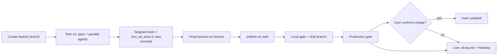

# Agent Workflows: Twin UI & Publish on Web

This document describes the two Cursor agent workflows defined for **outfit-suggestor-app**. Use them from chat with plain trigger phrases — no manual orchestration required.

---

## Overview

| Workflow | Purpose | When to use |
|----------|---------|-------------|
| **Twin UI** | Build matching web + iOS UI/UX from one instruction | Feature work, parity fixes, copy/layout changes on the **current branch** |
| **Publish on Web** | Test, commit, push, and deploy to production | Ready to ship after UI/backend changes are done |

They complement each other:

```text
Twin UI (iterate on branch)  →  publish on web (local gate → ship → production gate → optional merge to main)
```

Merge to `main` happens **only** after production gate passes and you confirm during publish on web.

---

## Twin UI

**One instruction → platform-neutral spec → two parallel agents (web + iOS) → parity review → targeted tests → `./run_all_tests` in a new terminal.**

### Trigger

```text
Twin UI:

[Describe the UI/UX change — screens, copy, behavior]
```

Also accepts: `Parallel UI/UX on current branch`, `spawn both web and iOS agents`.

**Twin** always means two platforms, two agents, in parallel.

### Example

```text
Twin UI:

Add Past Suggestions to the wardrobe card overflow menu. Fix the menu so it is not hidden behind the next card.

iOS: keep iPhone and iPad UX identical — layout/spacing tweaks via horizontalSizeClass only.
```

### iPhone / iPad (iOS)

Keep iPhone and iPad UX the same — adapt layout, not behavior. Optional one-liner on every Twin UI prompt (see `AGENTS.md` and `.cursor/rules/ios-ui-ux.mdc`).

### What happens (step by step)

1. **Confirm branch** — work stays on the current git branch (e.g. `feature/ui-ux-final-touches`).
2. **Write spec** — orchestrator creates `.cursor/specs/<feature-slug>.md` from the template, including **Tests (required)** and whether **About** / **Guide** need updates.
3. **Backend first (if needed)** — orchestrator updates `backend/` and runs **targeted** `pytest` when API or business logic changes. Skipped for pure UI work.
4. **Two parallel subagents** (single message, required):
   - **Web agent** → `frontend/**` only (includes `UserGuide.tsx` / `About.tsx` when spec requires)
   - **iOS agent** → `ios-client/**` only (includes `UserGuideView.swift` / `AboutView.swift` when spec requires)
5. **Parity review** — orchestrator compares both implementations to the spec, verifies About/Guide when required, and updates `IOS_WEB_FEATURE_PARITY.md` when capability changes.
6. **Targeted Test Report** — from agent-returned results only (spec-listed files/classes).
7. **Full matrix in a new terminal** — orchestrator starts `./run_all_tests` (repo root) without asking; does **not** wait on or paste suite logs into chat.
8. **Done** — when spec + targeted tests pass; full-suite pass/fail is watched in that terminal.

### Roles and boundaries

The **orchestrator** (main chat) may only touch:

- `.cursor/specs/`
- `backend/` (when the feature needs it)
- `IOS_WEB_FEATURE_PARITY.md`
- Supporting docs for the spec

The orchestrator **must not** edit platform UI directly:

| Agent | Allowed | Forbidden |
|-------|---------|-----------|
| Web | `frontend/**` | `ios-client/**`, `backend/**` |
| iOS | `ios-client/**` | `frontend/**`, `backend/**` |

### Mandatory tests (during Twin UI)

| Owner | Requirement |
|-------|-------------|
| Orchestrator | Targeted backend tests when `backend/` changes |
| Web agent | At least one new unit or integration test; run **only** spec-listed file(s) until green; update Guide/About when spec requires |
| iOS agent | At least one new unit/integration test; run **only** spec-listed class until green; update Guide/About when spec requires |
| Orchestrator (end) | Targeted report → new terminal `./run_all_tests` (no log ingest) |

**A Twin UI feature is not complete** if new behavior has no tests, targeted agent tests fail, or the Targeted Test Report is missing. Full-suite verification lives in the terminal.

### Test commands (reference)

```bash
# During work — web (targeted; use the path from the spec)
cd frontend && npm test -- --watchAll=false src/path/to/file.test.ts

# During work — iOS (targeted class from the spec)
cd ios-client && xcodebuild test \
  -scheme OutfitSuggestor \
  -destination 'platform=iOS Simulator,name=iPhone 17' \
  -only-testing:OutfitSuggestorTests/<TestClass>

# During work — backend (when changed; targeted)
cd backend && . venv/bin/activate && pytest tests/test_<feature>.py -q

# End of Twin UI / Cost Twin UI — full matrix in a new terminal (orchestrator launches; user watches)
./run_all_tests
```

### Commits

Agents **do not commit** unless you explicitly ask. Twin UI ends with implemented + targeted-tested code on your branch; you merge when ready.

### Configuration files

| File | Role |
|------|------|
| `.cursor/rules/parallel-ui-orchestrator.mdc` | Strict orchestration rules |
| `.cursor/rules/web-ui-ux.mdc` | Web agent scope |
| `.cursor/rules/ios-ui-ux.mdc` | iOS agent scope |
| `.cursor/skills/parallel-ui-ux/SKILL.md` | Full workflow, agent prompts, report template |
| `.cursor/specs/_template.md` | Spec template |
| `.cursor/specs/_test-report-template.md` | End-of-run report template |

---

## Publish on Web (v2)

**Local gate (agent terminal) → ship from current branch → production gate → optional merge to `main`.**

Invoking this skill counts as approval to **commit, push, and deploy** after gates pass. **Merge to `main`** requires a **separate** confirmation after production tests pass.

### Trigger

```text
publish on web
```

### What happens (step by step)

**Up to 3 attempts** — on failure: list failing tests, fix, **always redeploy** on retry.

1. **Cost estimate** — user approves before work starts.
2. **Local gate** — agent opens **new terminal**, runs `./run_all_tests`, **auto-reads** summary (`exit_code`, Overall PASS/FAIL, failing test list).
3. **Ship (no merge yet)** — commit → `git push -u origin HEAD` → `npm run deploy` → `railway up` → verify live URLs.
4. **Production gate** — second **new terminal**, `./run_production_tests` (Option C: same matrix vs live API), **auto-read** results and show report.
5. **Merge** — if production gate passes, ask user to confirm merge to `main`; on yes → merge + push `main`.
6. **Report** — Publish on Web — Report + workflow cost `end`.

| Gate | Command | What it runs |
|------|---------|----------------|
| Local | `./run_all_tests` | Web Jest + backend pytest (local) + iOS + UITests |
| Production | `./run_production_tests` | Jest (prod `REACT_APP_API_URL`) + `tests_remote` + iOS Release vs live API |

Production credentials: `.env.production.test` (from `.env.production.test.example`).

**If either gate fails:** no merge; agent fixes and retries from step 2 (full redeploy). Stop after 3 failed attempts.

### Prerequisites

| Tool | Purpose |
|------|---------|
| `git` / `gh` | Commit, push, merge |
| `railway` | Backend deploy |
| `frontend/.env.production` | Production API URL for build + gate |
| `.env.production.test` | `TEST_USERNAME` / `TEST_PASSWORD` for remote tests |

### Live URLs

| Target | URL |
|--------|-----|
| Custom domain | https://closiq.me |
| GitHub Pages | https://sajadparacha.github.io/outfit-suggestor-app |
| Backend (example) | https://web-production-dfcf8.up.railway.app |
| Health check | `<backend-url>/health` |

### Configuration

| File | Role |
|------|------|
| `.cursor/skills/publish-on-web/SKILL.md` | Full workflow v2 |
| `run_production_tests` | Production gate wrapper |
| `scripts/run_all_tests.sh --production` | Production matrix implementation |
| `.env.production.test.example` | Remote test credentials template |

---

## Typical development cycle


```mermaid
flowchart LR
  A[Create feature branch] --> B[Twin UI: spec + parallel agents]
  B --> C[Targeted tests + ./run_all_tests in new terminal]
  C --> D[Final touches on branch]
  D --> E[publish on web]
  E --> F[Local gate + ship branch]
  F --> G[Production gate]
  G --> H{User confirms merge?}
  H -->|yes| I[main updated]
  H -->|no| J[Live: closiq.me + Railway]
  G --> J
```

1. **Branch** — e.g. `git checkout -b feature/ui-ux-final-touches`
2. **Twin UI** — iterate with matched web + iOS changes; agents run related tests; full matrix via `./run_all_tests` in a new terminal
3. **Publish on web** — agent runs local gate → ships from branch → production gate → asks to merge `main` if production passes (up to 3 retries, always redeploy on retry)

---

## Quick reference

| I want to… | Say this |
|------------|----------|
| Change UI on web **and** iOS | `Twin UI: [description]` |
| Run local gate + deploy + production gate | `publish on web` (agent launches `./run_all_tests` and `./run_production_tests` in new terminals) |
| All local tests only | `./run_all_tests` |
| Production gate only (after deploy) | `./run_production_tests` (requires `.env.production.test`) |
| Run all tests (web + backend + iOS + UITests) | `run_all_tests` (from repo root; see alias below) |
| See web/iOS parity status | Open `IOS_WEB_FEATURE_PARITY.md` |
| Read agent entry point | Open `AGENTS.md` |

---

## Related docs

- [docs/linkedin-agent-workflows-2026-06-09.md](docs/linkedin-agent-workflows-2026-06-09.md) — LinkedIn-ready achievement writeup
- [AGENTS.md](AGENTS.md) — short agent workflow index
- [IOS_WEB_FEATURE_PARITY.md](IOS_WEB_FEATURE_PARITY.md) — feature parity checklist
- [ARCHITECTURE.md](ARCHITECTURE.md) — app structure
- [WEB_USER_INTERACTION.md](WEB_USER_INTERACTION.md) — web UX patterns
