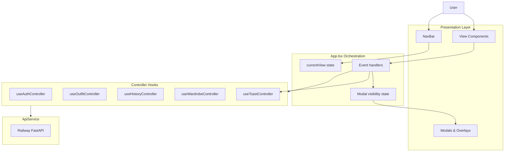

# Web Application User Interaction — Complete Description

The Outfit Suggestor web app (https://closiq.me) is a **single-page React application** with no URL-based routing. All interaction is driven by **view state** in `App.tsx`, **controller hooks** for business logic, and **presentation components** for UI. The design favors **optional authentication** (anonymous users can get outfit suggestions) and **progressive gating** (wardrobe, history, and insights require login).

---

## 1. Interaction Architecture



| Layer | Role |
|--------|------|
| **App.tsx** | Owns navigation, modals, cross-view state, and wires controllers to views |
| **Controllers** | API calls, validation, loading/error state |
| **Views** | Render UI; emit callbacks upward |
| **ApiService** | HTTP + JWT; logs requests in dev |

---

## 2. Navigation Model

Navigation is **not** route-based. `currentView` switches entire page content:

| View ID | Nav label | Auth required |
|---------|-----------|---------------|
| `main` | Suggest | No |
| `wardrobe` | Wardrobe | Yes (full UI) |
| `history` | History | Yes |
| `insights` | Insights | Yes |
| `guide` | Guide | No |
| `about` | About | No (footer) |
| `settings` | Settings | Yes |
| `reports` | Reports | Admin only |
| `integration-tests` | Tests | Admin + env flag |

**NavBar** (`NavBar.tsx`):

- Sticky header; logo returns to **Suggest**
- Horizontal scroll nav on mobile (second row)
- **Sign Up / Login** when logged out
- When logged in: avatar → Settings, **Logout**, admin **Reports** / **Tests**

**Footer**: collapsible “More options” → User Guide, About

---

## 3. Authentication Interaction

### Access model

- **Anonymous**: Can use **Suggest** (upload + AI outfit)
- **Authenticated**: Wardrobe, History, Insights, Settings, random-from-wardrobe/history
- App does **not** force login on load; gated views show a login prompt

### Login / Register

- **Modal overlay** (not a separate page)
- Opened from NavBar, gated views, or wardrobe CTAs
- Backdrop click or ✕ closes modal
- **Register** ↔ **Login** toggle inside modal
- On success: modal closes, success toast, optional **intro overlay** (first time only, `localStorage.intro_hero_seen`)

### Session

- JWT in `ApiService`; validated on load via `useAuthController`
- Initial load: full-screen spinner until auth check completes
- Logout: clears token, toast confirmation

### Settings (`settings` view)

- Email, name
- **Change Password** (inline form)
- Link to **Manage Wardrobe**

---

## 4. Global Feedback & Blocking Patterns

### Toast notifications

- Bottom-right, 3s auto-dismiss (manual close)
- Types: **success** (brand gradient) / **error** (red)
- Used for validation, API outcomes, feedback (like/dislike)

### Loading overlay (global lock)

When `loading` (outfit) or `wardrobeGapLoading` (analysis):

- Full-screen overlay with spinner + message
- **`pointer-events: none`** on main shell — entire app blocked
- Messages: e.g. “Generating AI suggestion…”, “Running Premium Analysis with ChatGPT…”

### Confirmation modals (`ConfirmationModal`)

| Trigger | Choices |
|---------|---------|
| Duplicate outfit image | Use Existing / Get New |
| Model image generation | Yes, Generate / Skip for Now |
| Duplicate wardrobe item | Add Anyway / Cancel |

### Other overlays

- Intro hero (post first login)
- Camera capture
- Add-to-wardrobe review form
- Wardrobe analysis mode picker (Basic vs Premium)
- Image enlargement (upload, model, wardrobe thumbs)

### Error boundaries

- Wardrobe, Reports, Integration Tests wrapped in `ErrorBoundary`

### Persisted preferences (`localStorage`)

- `show_ai_prompt_response` — admin AI panel toggle
- `intro_hero_seen` — intro overlay

---

## 5. Main Flow — Outfit Suggestion (`main` view)

Two-column layout (stacked on mobile): **Sidebar** (input) + **OutfitPreview** (output).

### 5.1 Image input (`Sidebar.tsx`)

| Action | Behavior |
|--------|----------|
| **Upload Item** | Hidden file input; JPG/PNG/WebP; max size enforced |
| **Drag & drop** | Same validation on drop zone |
| **Take Photo** | Camera modal if device has camera; rear-facing preferred |
| **Preview** | Thumbnail; tap to enlarge |
| **Clear preferences** | Resets occasion/season/style/notes to defaults |

**Preference controls** (shared with Insights):

- **Occasion**: casual, business, formal, party, date, sports
- **Season**: all, spring, summer, fall, winter
- **Style**: modern, business casual, casual, classic, trendy, minimalist, bold, vintage
- **Colors**: display-only (“No Preference”)
- **Notes**: modal editor for free-text context

### 5.2 Wardrobe options (authenticated, collapsible)

- **Add to Wardrobe**: AI analyzes image → duplicate check → review modal
- **Use my wardrobe only**: toggle; AI limited to owned items

### 5.3 Generate outfit

1. User taps **Generate Outfit** (disabled without image)
2. If model image enabled → confirmation modal
3. Controller: compress → optional duplicate check → API
4. Duplicate found → modal: cached history vs new AI call
5. Result in **OutfitPreview**; history refreshed

### 5.4 Quick picks (authenticated, collapsible)

- **Random from Wardrobe** — uses current preferences
- **Random from History** — random saved entry → main view

### 5.5 Display options (URL `?modelGeneration=true` only)

- **Generate Model Image** toggle
- Model selector: DALL-E 3, Stable Diffusion, Nano Banana

### 5.6 Admin toggle (main sidebar)

- **Show AI Prompt & Response** — persisted; controls admin diagnostics in preview

### 5.7 Outfit result (`OutfitPreview.tsx`)

**States**: loading skeleton → error + Try Again → empty placeholder → full result

**Result UI**:

- Uploaded item / AI model preview (tap to fullscreen)
- Five **OutfitItemCard** slots: shirt, trouser, blazer, shoes, belt  
  Tags: “From your upload”, “From your wardrobe”, or “AI Suggested”
- **Why This Works** reasoning
- Admin: cost breakdown, prompt/response panels

**Actions**:

| Button | Effect |
|--------|--------|
| **Regenerate Outfit** | New suggestion (same photo; “next outfit” context) |
| **Like Outfit** | Success toast only |
| **Try Variation** | Toast + triggers new suggestion |
| Style chips (Casual, Business, Smart Casual) | Same as Regenerate |
| **Open Wardrobe** | Navigate to wardrobe |
| **Add to Wardrobe** | Same pipeline as sidebar (if image present) |

### 5.8 Below the fold

- **HowItWorksStepper** — static explainer
- **RecentLooksSection** — recent history; **View All** → History (auth)

---

## 6. Wardrobe Flow (`wardrobe` view)

Requires login. Uses `useWardrobeController` + outfit controller bridge.

### Header actions

- **Analyze My Wardrobe** → analysis mode modal (Basic / Premium)
- **Add Item** → add modal with image upload + AI field extraction

### Browse & filter

- Category chips: All, shirt, trouser, blazer, shoes, belt, other
- Search with clear
- Pagination
- Summary stats

### Per-item actions

| Action | Behavior |
|--------|----------|
| **View image** | Fullscreen viewer |
| **Get AI Suggestion** | Loads item image into main flow → generates outfit → navigates to **main** |
| **History** | Modal of past outfits referencing this item |
| **Edit** | Modal: category, color, description, optional new image + re-analysis |
| **Delete** | Immediate delete |

### Duplicate handling

- On add: perceptual hash check → confirm to add anyway

### Deep links

- From outfit preview: `wardrobeCategoryFilter` pre-selects category

---

## 7. Insights Flow (`insights` view)

**Wardrobe Gap Analysis** — login required.

### Setup panel

- Occasion, Season, Style, Extra Notes (shared filter state with main)
- **Clear** — resets preferences
- **Analyze My Wardrobe** → mode modal:
  - **Basic Analysis** — rules-based, fast
  - **Premium Analysis** — ChatGPT; global loading overlay

### Results (`WardrobeGapAnalysis.tsx`)

| Section | Interaction |
|---------|-------------|
| Context summary | Occasion • Season • Style; depth Basic/Premium |
| Priority Shopping List | Ranked items; **Show outfit examples** → Google Shopping (`tbm=shop`) |
| Snapshot metrics | Categories analyzed, missing colors/styles, top buy-next |
| Category cards | Missing color swatches (click → shopping search), style chips |
| **Find similar items** | Expands owned/missing details + recommendations |
| Admin diagnostics | Cost, prompt, raw response (premium runs) |

**Empty state**: “Run analysis to get category-wise…”

**Error state**: Inline error message

---

## 8. History Flow (`history` view)

Requires login. `OutfitHistory` + `useHistorySearchController`.

| Interaction | Behavior |
|-------------|----------|
| Search | Text filter; Enter to search; clear |
| Sort | Date, occasion, etc. |
| Refresh | Reload from API |
| Load all | Paginated → full list |
| View images | Model vs upload fullscreen |
| Delete | `window.confirm` then API delete |

Search highlights matching text in entries.

---

## 9. Guide & About

- **Guide** (`UserGuide.tsx`): in-app manual with TOC chips (anchor scroll): quick start, suggestion flow, results, insights, wardrobe, random/history, account, PWA install, tips
- **About**: product/tech overview (nav via footer)

---

## 10. Admin-Only Interactions

| Feature | Access | Interaction |
|---------|--------|-------------|
| **Reports** | `user.is_admin` | Access logs, usage stats, filters |
| **Integration Tests** | Admin + `REACT_APP_ENABLE_ADMIN_TEST_RUNNER` or localhost | Run remote test suites from UI |
| **AI diagnostics** | Admin + toggle | Prompt/response/cost on suggestions and insights |
| **Analysis cost** | Admin on insights | Token and USD breakdown |

---

## 11. Mobile & Accessibility Patterns

- **Touch targets**: `min-h-[44px]`, `touch-manipulation` on primary controls
- **Responsive**: Nav two-row on mobile; wardrobe cards stack; insights grids collapse
- **ARIA**: `aria-label` on uploads, filters, nav (`aria-current="page"`), modals (`role="dialog"`)
- **Keyboard**: Enter in history search
- **Screen readers**: `sr-only` labels; semantic headings
- **Overflow**: `overflow-x-hidden` on app root; horizontal scroll only in nav

---

## 12. End-to-End User Journeys

### Journey A — Anonymous first outfit

```
Land on Suggest → Upload photo → Set preferences → Generate Outfit
→ View result → (optional) Like / Regenerate
```

### Journey B — Registered power user

```
Sign Up → Intro overlay (once) → Add items to Wardrobe
→ Enable "Use my wardrobe only" → Generate from upload
→ Insights → Premium Analysis → Shopping links from gaps
→ History → Search past looks
```

### Journey C — Wardrobe item → outfit

```
Wardrobe → Select item → Get AI Suggestion
→ Main view (image preloaded) → Toast → Generate / review result
```

### Journey D — Duplicate-aware flows

```
Upload same photo twice → "Similar Image Found" modal
→ Use Existing (history) OR Get New (fresh AI)

Add similar wardrobe item → Duplicate modal → Add Anyway OR Cancel
```

---

## 13. Interaction Design Principles (as implemented)

1. **Optional auth** — core value (suggestions) works without account
2. **Modal-first confirmations** — destructive or costly actions need explicit consent
3. **Global busy state** — long AI operations block duplicate submissions
4. **Toast-first feedback** — lightweight success/error without page changes
5. **Shared preference state** — occasion/season/style/notes reused across Suggest and Insights
6. **Graceful degradation** — premium analysis falls back to basic with in-result message (no hard error)
7. **Progressive disclosure** — collapsible sections (Wardrobe options, Quick Picks, Display Options, category details in insights)
8. **External handoff** — shopping searches open Google in new tab, not in-app commerce

---

## 14. Key Source Files

| Concern | Primary file(s) |
|---------|------------------|
| View routing & modals | `frontend/src/App.tsx` |
| Main input panel | `frontend/src/views/components/Sidebar.tsx` |
| Result panel | `frontend/src/views/components/OutfitPreview.tsx` |
| Wardrobe CRUD & item actions | `frontend/src/views/components/Wardrobe.tsx` |
| Gap analysis UI | `frontend/src/views/components/WardrobeGapAnalysis.tsx` |
| Navigation | `frontend/src/views/components/NavBar.tsx` |
| Outfit logic | `frontend/src/controllers/useOutfitController.ts` |
| Auth | `frontend/src/controllers/useAuthController.ts` |
| In-app documentation | `frontend/src/views/components/UserGuide.tsx` |
